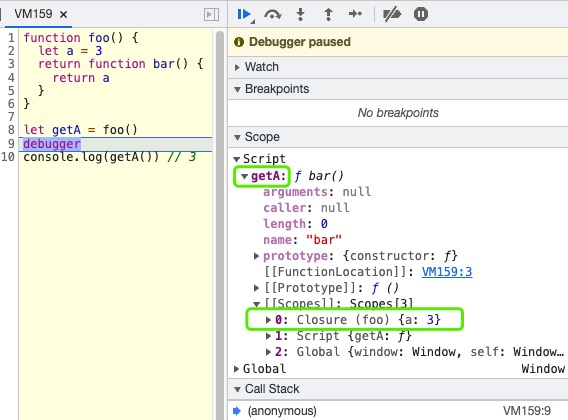

# 闭包必知必会

闭包是 js 中常见的知识点，也是面试中常考的知识点。对于闭包你需要掌握以下几点：
+ 什么是闭包？
+ 闭包是如何产生的？
+ 与闭包相关的概念
+ 闭包的常见应用
+ 闭包会引起的问题
+ 面试题实战

## 什么是闭包

> 闭包是函数和与其相关的引用环境组合而成的实体。

闭包是在实现深约束时，需要创建一个能显示表示引用环境的东西，并将它与相关的子程序捆绑在一起，这样捆绑起来的整体被称为闭包。

### 闭包与函数的重要区别
很多时候闭包和函数是分不开的，更有甚者认为函数就是闭包。但其实这是不准确的。**函数是一些可执行的代码，这些代码在函数被定义后就确定了，不会在执行时发生变化，所以一个函数只有一个实例**。**闭包在运行时可以有多个实例，不同的引用环境和相同的函数组合可以产生不同的实例**。所谓引用环境是指在程序执行中的某个点所有处于活跃状态的约束组成的集合。其中的约束是指一个变量的名字和其所代表的对象之间的联系。

那么在 js 中，闭包是如何产生的哪？
## 闭包是如何产生的？

> 函数嵌套函数时，内层函数引用了外层函数作用域下的变量，并且内层函数在全局环境下可访问，就形成了闭包。

有闭包特性的语言往往有以下两个特点：
+ 函数时一等公民，即函数可以作为另一个函数的参数或者返回值，还可以作为一个变量的值（函数可以作为值传递）。
+ 函数可以嵌套定义，即在一个函数内部可以定义另一个函数

一个函数如何能封闭外部状态哪？**当外部状态的 scope 失效的时候，还有一份保留在内部状态里面**。在执行过程中，返回函数，或者将函数保留下来，并且函数中有自由变量就会形成闭包。**一个函数中没有自由变量时，引用环境不会发生变化**。

> 自由变量是指没有在相关函数作用域中声明，但是使用了的变量。
## 与闭包相关的概念

说到这里，需要了解一下在 js 中与闭包相关的概念。
### 作用域

作用域其实就是一套**用于在特定场景下查找变量的规则**。在 ES6 出现之前只有函数作用域和全局作用域。
#### 暂时性死区
在 ES6 之后则有了块级作用域。这里有一个需要注意的暂时性死区概念需要注意：
```js
{
  // 在这条语句上边是无法访问变量 c 的
  let c = 1
}
```

> 在块级作用域中，如果在变量声明前访问该变量，就会报 referenceError 错误。

#### 默认参数的作用域
这里还有一个比较偏的知识点就是 ES6 默认参数的作用域问题。默认参数会形成一个单独的作用域。等到初始化结束，这个作用域会消失。这种语法行为，在不设置参数默认值时，是不会出现的。举个栗子：

```js
var x = 1
function f(x, y = x) {
  console.log(y)
}

f(2) // 2 这里 y 的默认值等于传入的 x 的值
```

上边的默认值变量`y`后边的`x`并不是全局变量`x`，而是指向第一个参数`x`。
这里只是简单举个栗子，详细请参考阮一峰大佬 《ES6 入门》的函数的扩展一节。

#### 闭包与作用域
在 js 中，如果我们**查找一个变量，在当前的作用域中，没有找到，都会向外层作用域中去查找**。在两个函数嵌套的场景中，当我们在内层函数中访问一个不存在的变量时，就会去外层函数中查找。看下面一段代码：
```js
function foo() {
  let a = 3
  function bar() {
    console.log(a)
  }
  bar()
}
foo() 
```
这里`bar`函数的作用域中并没有`a`变量，此时就会去外层作用域中查找，如果没有找到，就会去更外层的作用域中查找（这里对应全局作用域）。对于上边一段代码并不会形成闭包。**原因是虽然内层函数引用了外层函数里的自由变量，但是这里并没有将内层函数保存下来**。


如果内层函数不能在全局环境下访问，就不会形成闭包，因为会随着执行栈的弹栈被销毁，**如果内层函数在全局环境下可以被访问，就会形成闭包**。将上边代码改一改：

```js
function foo() {
  let a = 3
  return function bar() {
    return a
  }
}

let getA = foo()
debugger
console.log(getA()) // 3
```
我在打印这里打上一个断点，可以在 Chrome 控制台里看到这些信息:

你会发现，如果在上边打印`a`代码中打上断点，你也会发现有类似的字段，那是不是说明也存在闭包哪？
> 答案是否定的。


### 执行上下文和调用栈
为了解释上边的问题，简单说一下执行上下文和调用栈。

执行上下文就是当前代码的执行环境和作用域，和前边的作用域链是完全不同的概念。执行上下文包含了作用域链。

#### 代码执行的两个阶段
JavaScript 执行主要分为两个阶段：
+ 代码预编译阶段
+ 代码执行阶段

预编译阶段是前置阶段，这个时候编译器将 js 代码编译成可执行的代码。执行阶段主要任务是执行代码，执行上下文在这个阶段全部创建完成。

经过预编译过程，应该注意三点：
+ 预编译阶段进行变量声明
+ 与编译阶段变量声明进行提升，但是值为 undefined
+ 预编译阶段所有非表达式的函数声明进行提升


作用域在预编译阶段确定，但是作用域链在执行上下文的创建阶段完全生成。因为函数在调用时，才会开始创建对应的执行上下文。执行上下文包括：
+ 变量对象
+ 作用域链
+ this

代码执行的整个过程：
+ 预编译阶段创建变量对象（Variable Object），此时知识创建，而未赋值。
+ 代码执行阶段，变量对象转为激活对象(Active Object)，即完成 `VO -> AO`。此时，作用域链将被确定

回到上边的代码，在执行过程中，经过预编译和代码的执行，当执行到`bar`时，会创建执行上下文，这里包括作用域链和变量对象。根据作用域的规则，在这里查找变量`a`时，并未找到，那么就会到外层作用域`foo`中找到`a`。这是不是就说明形成了闭包哪？还没完哪！

#### 调用栈
我们在执行函数的时候，如果一个函数调用了另外一个函数，多个函数层层调用，便会形成一系列的调用栈。这个过程是**后进先出**，典型的栈数据结构。

正常来讲，在函数执行完毕出栈时，函数内局部变量会在下一个垃圾回收节点会被回收，该函数对应的上下文会被销毁。也就是说，如果不将内层函数保存下来的话，函数会随着出栈，在垃圾回收时做清理工作，那么这个时候绑定的 `scope`也就是执行上下文，会被销毁掉。所以上文中的两段代码，只有将外层函数保存下来，才会产生闭包。

## 闭包的常见应用

知道了什么是闭包，也理解了闭包的本质，以及怎样才会形成闭包。下面可以了解下闭包的几种应用，或许你在日常的开发中已经用到不少了。

### 封装私有变量，存储计算的值

```js
// 将计算的结果保存在 sum 中
function add(init) {
  var sum = init;
  return function getSum(number) {
    sum += number;
    return sum;
  }
}
```

### 延迟计算

```js
// 延迟计算
function add(init) {
  var sum = init;
  var args = [];
  return function getSum() {
    // 当参数到达一定的数量时再进行运算
    args = args.concat(Array.from(arguments));
    if(args.length > 5) {
      for(let i = 0; i < args.length; i++) {
        sum += args[i];
      }
      return sum;
    }
  }
}
```

### 延续局部变量的寿命

```js
// 这种方法会丢失 30% 左右的数据
var report = function (src) {
  var img = new Image();
  img.src = src;
};

// 把 img 变量封装起来，就可以解决请求丢失的问题
var report = (function(){
  var imgs = [];
  return function(src) {
    var img = new Image();
    imgs.push(img);
    img.src = src;
  }
})();
```

img 对象经常用于进行数据上报，但是通过查询后台的记录可以得知，因为一些低版本的浏览器的实现可能存在 bug，在这些浏览器下使用 report 函数进行数据上报会丢失 30% 左右的数据，也就是说，report 函数并不是每一次都发起了 HTTP 请求。丢失数据的原因是 img 是 report 函数中的局部变量，当 report 函数调用结束后， img 局部变量随即被销毁，而此时或许还没来得及发出 HTTP 请求，所以此次请求就会丢失掉。

### 私有数据和应用程序接口

有时，你想强制程序与数据的交互方式，以便保护其完整性。通过是使用闭包，完全可以做到这一点。创建此类接口的一种常见方法就是从函数返回对象。这时，定义在原函数中的数据只能由返回对象上定义的方法访问，下面是一个例子：

```js
function makeCalendar(name) {
  var calendar = {
    owner: name,
    events: [],
  };
  
  return {
    addEvent: function(event, dateString) {
      var eventInfo = {
        event: event,
        date: new Date(dateString),
      };
      calendar.events.push(eventInfo);
      calendar.events.sort(function(a, b) {
        return a.date - b.date;
      });
    },
    
    listEvents: function() {
      if (calendar.events.length > 0) {
        console.log(calendar.owner + "'s events are: ");
        
        calendar.events.forEach(function(eventInfo) {
          var dateStr = eventInfo.date.toLocaleDateString();
          var description = dateStr + ": " + eventInfo.event;
          
          console.log(description);
        });
      } else {
        console.log(calendar.owner + " has no events.");
      }
    },
  };
}
```

## 闭包会引起的问题

局部变量本来应该在函数退出的时候被解除引用，但如果局部变量被封闭在闭包形成的环境中，那么这个局部变量就会一直存在。在这个意义上看，闭包的确会使一些数据无法被及时销毁。使用闭包的一部分原因是我们选择主动把一些变量封闭在闭包中，因为可能在以后还需要使用这些变量，把这些变量放在闭包中和放在全局作用域，对内存方面的影响是一致的。如果在将来需要回收这些变量的时候，可以手动把这些变量设置为 null。

```js
function foo() {
  var a = 4
  function bar() {
    console.log(++a)
  }
  return bar
}
var bar = foo()
bar()

// bar = null // 不会再用到 bar 的时候释放内存
```

## 面试题实战

```js
const foo = (function() {
  var v = 0
  return () => {
    return v++
  }
}())

for(let i = 0; i < 10; i++) {
  foo()
}
console.log(foo()) // 10
```
这里自执行函数返回了内层的箭头函数并保存在`foo`函数中。这里产生了一个闭包，保存了变量`V`的值。并在每次执行后加 1。
```js
var fn = null
const foo = () => {
  var a = 2
  function innerFoo() {
    console.log(a)
  }
  fn = innerFoo()
}
const bar = () => {
  fn()
}

foo()
bar() // 2
```
这里先执行了`foo`函数，将内层函数`innerFoo`保存在了全局变量`fn`中，形成了闭包。执行`fn`打印出`a`的值。

### 利用闭包实现单例模式

> 单例模式，是一种常见的软件设计模式。保证一个类只有一个实例，并提供一个访问它的全局访问点。

```js

function ThrowNewError() {
  // ...
}

const getInstance = (function() {
  var instance
  return function(){
    if(!instance) {
      instance = new ThrowNewError()
    }
    return instance
  }
})()
```