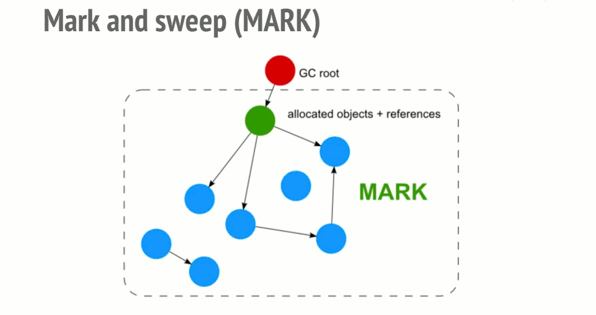

# 垃圾回收

所有运行的程序都必须管理使用计算机内存的方式。一些语言中具有垃圾回收机制（例如我们常用的 JavaScript），在程序运行时不断寻找不再使用的内存；在另一些语言中，程序员必须亲自分配和释放内存。

## 相关概念

**内存管理**是计算机科学中的概念。不论是什么程序语言，内存管理都是指对内存生命周期的管理。那么内存的生命周期包括哪些阶段哪？

### 内存生命周期
内存生命周期分为三个阶段：

+ 分配内存空间
  + 内存是被操作系统分配，这允许程序使用它，在低级语言中（例如：C 语言），这需要开发者调用相关 API 显式操作。在高级语言中，会有 GC（Garbage Collector）帮助开发者处理。
+ 使用内存空间
  + 使用之前分配的内存空间，通常是通过操作变量对内进行读和写
+ 释放内存空间
  + 不用的时候，释放内存，以便重新分配。

在内存的整个生命周期中，理想的状况是内存能够在需要的时候有足够的空间分配给程序使用，在不用的时候应用程序能够及时将内存交还给操作系统。然而，很多时候，往往事与愿违！

### 内存溢出与内存泄漏

+ **内存溢出**（Out of Memory）：就是申请内存的时候，没有足够的内存空间。
+ **内存泄漏**（Memory Leak）：就是申请了内存，在内存不使用的时候，没有释放，导致内存空间浪费。

拿蹲坑做类比。前者可以看做是**坑位满了，你找不到坑位；后者可以看做是占着茅坑不拉那啥**。当然，两种情况都是非常糟糕的。所以，很多时候，避免两种情况的发生，就成了写代码的我们需要关注的地方。想要合理地使用内存，那么了解垃圾回收机制是必须的。

这里总是提到内存，那么我们所讲的内存到底是指哪些内存哪？
> 堆内存。

### 栈（Stack）与堆（Heap）

堆和栈都是代码在运行时可供使用的内存，但是他们的结构不同。**栈以放入值的顺序存储并以相反顺序取出值**。这也被称作后进先出（last in，first out）。**栈中的所有数据都必须占用已知且固定的大小**。在编译时，大小未知或大小可能发生变化的数据，要改为存储在堆上。

堆是缺乏组织的：当向堆放入数据时，你要请求一定大小的空间。内存分配器（memory allocator）**在堆的某处找到一块足够大的空间**（如果找不到，这个时候就会出现内存溢出错误），**并返回一个表示该位置地址的指针**，或者返回一个存储了该位置地址的变量，两种说法都是可以的。

当你的代码调用一个函数时，传递给函数的值（包括可能是指向堆上数据的指针）和局部变量被压入栈中。当函数结束后，这些值被移出栈。这时跟踪哪部分代码正在使用堆上的数据，减少堆上的重复数据的数量，以及清理堆上不再使用的数据确保不会耗尽空间，正是垃圾回收机制需要做的事情。那么，JavaScript 引擎的垃圾回收机制是怎样的哪？它又是如何运作的哪？

## 两种垃圾回收机制
> 垃圾回收算法依赖的主要概念是引用。

在内存管理的语境中，一个对象只要显示或隐式访问另一个对象，就可以说它引用了另一个对象。在这种情况下，”对象“的概念扩展到比普通 JavaScript 对象更广的范围，并且还包括函数作用域。

### 引用计数垃圾回收
这种垃圾回收机制比较简单，就是计算堆内存的引用个数，当某个内存块的引用个数为 0 的时候，就会在下一次 gc 的时候被释放掉。为什么是下一次 gc 哪？这个后边再讲。先举个栗子：
```js
var a = { name: 'thrownewerror', age: 18} // 这里对象的有一个引用

a = null // 这里上边的字面量对象的引用就没有了（手动释放）
```

上述代码非常简单，用变量`a`存储了一个对象，对象是存储在堆内存上的，这里`a`变量内部实际上存储的是字面量对象的一个引用，对于引用计数垃圾回收来说，这里会统计关于字面量对象的引用个数。对于不再使用的全局对象，及时手动释放是个不错的习惯。

#### 循环引用

引用计数就是计算对某个对象的引用的个数，那么考虑一下两个对象互相引用的情况：
```js
var obj1 = {}
var obj2 = {}
obj1.key = obj2
obj2.key = obj1
```

很明显产生了循环引用，这样对于对象`obj1`和`obj2`来说，总是有一个引用指向它们，那么这两个对象所占的内存空间就无法被引用计数垃圾回收器回收。自 2012 年以后，浏览器纷纷采用另外一种垃圾回收算法——标记清除法。

### 标记清除法
这个算法查找从根开始无法访问的对象，这个根是 JavaScript 的全局对象。该算法克服了引用计数算法的局限性。

该算法从根开始，遍历所有其他对象，同时标记它们。它进一步变量被遍历的对象并标记它们。这个过程将重复直到所有已被遍历的节点没有任何子节点和可遍历的路径。因此，所有没有被标记的对象显然都是无法从根节点开始访问的，这意味着它们可以被垃圾回收，稍后通过删除这些对象释放内存。下面试该算法的一个动态示意图：


如果两个循环引用的对象变为不可达时（不同通过根访问时）也会被垃圾回收，这很好弥补了引用计数法的缺陷。但是它也有一些局限性。

> 对象必须显式地设置为不可访问才能在后续的 GC 中被垃圾回收。
### 垃圾回收的行为特性
说完了两种垃圾回收的机制，你可能会问，什么时候会进行垃圾回收哪？可以很负责任的告诉你，这是不可预测的。

垃圾回收器有一套自己的方案，它在某个不确定的时刻进行。这意味着程序在某些情况下会使用比实际需求还要多的内存。在其他情况下，在特别敏感的应用程序中，可能会出现短停顿。尽管不确定意味着不能确定回收工作何时执行，但大多数GC实现都会在分配内存的期间启动收集例程。如果没有内存分配，大部分垃圾回收就保持空闲。参考下面的情况：
+ 执行相当大的一组分配
+ 这些元素中的大部分（或者所有）都被标记为不可到达的
+ 没有更多的分配被执行

这也是 JS 不适合用来处理一些对性能要求比较高的场景，因为在 GC 期间，会有性能消耗，代码不会继续执行（在 GC 期间程序中断运行了）。垃圾回收机制是一种有损耗的抽象。如果对性能有较高要求，可以选用 Rust、C++ 这类零成本抽象的语言。
## JS 中常见的几种内存泄漏

这里补充四种常见的 JS 内存泄漏，要在平时编码的时候尽量避免。
### 意外的全局变量
对未声明的变量的引用会在全局对象里创建一个新的变量。
```js
function foo(arg) {
  bar = "Memory Leak"
}

// 等同于

function foo(arg) {
  window.bar = "Memory Leak"
}
```

如果忘记了使用关键字（类似`var`、`let`）去声明变量，一个意外的全局变量就会被声明。在这里，泄漏一个简单的字符串并不会造成很大的危害，但是这种错误的编码方式应该被开发者重视。


另一种意外创建全局变量的方法是通过`this`：
```js
function Foo() {
  this.val = "Memory Leak"
}

// Foo 作为函数调用，this 指向全局变量（window）
Foo()
```
> 为了防止这些问题发生，可以在 JS 文件开头使用`'use strict';`。通过严格的解析模式阻止意外的全局变量。

除了意外创建的全局变量，我们自己创建的用于存放大量数据的全局变量也应该在使用完毕后为其赋值`null`，以确保在下一次 GC 的时候被及时释放。

### 被遗忘的定时器或者回调
定时器可能会导致对不需要的节点或者数据的引用。
```js
var serverData = loadData();
setInterval(function() {
    var renderer = document.getElementById('renderer');
    if(renderer) {
        renderer.innerHTML = JSON.stringify(serverData);
    }
}, 5000); //每5秒执行一次
```

`renderer`对象在将来有可能被移除，让`interval`处理器内部的整个块都变得没有用。但由于`interval`仍然起作用，处理程序并不能被回收（除非`interval`停止）。如果`interval`不能被回收，它的依赖也不可能被回收。这就意味着`serverData`，大概保存了大量的数据，也不可能被回收。

### 闭包

闭包是 JavaScript 开发的一个关键方面：一个内部函数使用了外部（封闭）函数的变量。由于 JavaScript 运行时实现的不同，它可能以下面的方式造成内存泄漏：
```js
var theThing = null;

var replaceThing = function () {
  var originalThing = theThing;
  var unused = function () {
    if (originalThing) // 引用'originalThing'
      console.log("hi");
  };

  theThing = {
    longStr: new Array(1000000).join('*'),
    someMethod: function () {
      console.log("message");
    }
  };
};

setInterval(replaceThing, 1000);
```

这段代码做了一件事：每次`ReplaceThing`被调用，`theThing`获得一个包含大数组和新的闭包(`someMethod`)的对象。同时，变量`unused`保持了一个引用`originalThing`(`theThing`是上次调用`replaceThing`生成的值)的闭包。已经有点困惑了吧？**最重要的事情是一旦为同一父域中的作用域产生闭包，则该作用域是共享的**。

这里，作用域产生了闭包，`someMethod`和`unused`共享这个闭包中的内存。`unused`引用了`originalThing`。尽管`unused`不会被使用，`someMethod`可以通过`theThing`来使用`replaceThing`作用域外的变量（例如某些全局的）。而且`someMethod`和`unused`有共同的闭包作用域，`unused`对`originalThing`的引用强制`oriiginalThing`保持激活状态(两个闭包共享整个作用域)。这阻止了它的回收。

当这段代码重复执行，可以观察到被使用的内存在持续增加。垃圾回收运行的时候也不会变小。从本质上来说，闭包的连接列表已经创建了(以`theThing`变量为根)，这些闭包每个作用域都间接引用了大数组，导致大量的内存泄漏。

### DOM 外引用
有的时候在数据结构里存储DOM节点是非常有用的，比如你想要快速更新一个表格几行的内容。此时存储每一行的DOM节点的引用在一个字典或者数组里是有意义的。此时一个DOM节点有两个引用：一个在dom树中，另外一个在字典中。如果在未来的某个时候你想要去移除这些节点，你需要确保两个引用都不可到达。

```js
var elements = {
  button: document.getElementById('button')
  image: document.getElementById('image')
}

function removeImage() {
  // image 是 body 元素的子节点
  document.body.removeChild(document.getElementById('image'))
  
  // 这个时候在全局的 elements 对象里仍然有一个对 #image 的引用。
  // image 元素仍然在内存中而且不能被回收
  elements.image = null // 手动释放
}
```

当涉及DOM树内部或子节点时，需要考虑额外的考虑因素。例如，你在 JavaScript 中保持对某个表的特定单元格的引用。有一天你决定从 DOM 中移除表格但是保留了对单元格的引用。人们也许会认为除了单元格其他的都会被回收。实际并不是这样的：单元格是表格的一个子节点，子节点保持了对父节点的引用。确切的说，JS代码中对单元格的引用造成了整个表格被留在内存中了，所以在移除有被引用的节点时候要当心。
